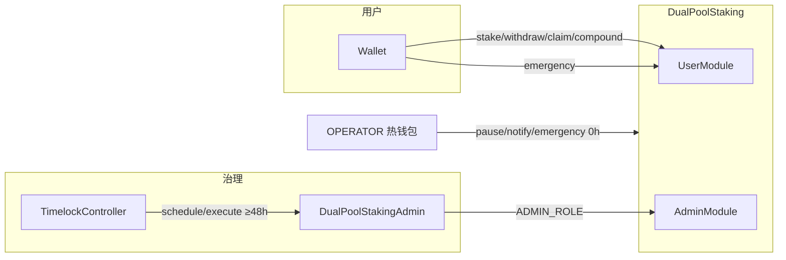

# DualPoolStaking — 平行双池复合奖励质押系统

基于 Foundry 构建的 Solidity 智能合约 + Next.js 前端 DApp，实现**平行双池（Parallel Dual-Pool）复合奖励质押协议**。完整数学公式、状态机与安全矩阵见 [`PRD.md`](PRD.md)。

## 目录

- [架构概览](#架构概览)
- [核心特性](#核心特性)
- [项目结构](#项目结构)
- [快速开始](#快速开始)
- [合约说明](#合约说明)
- [前端 DApp](#前端-dapp)
- [测试](#测试)
- [部署与治理](#部署与治理)
- [安全设计](#安全设计)
- [工程文档](#工程文档)

## 架构概览

本协议采用**平行双池**设计，通过负债累积模型（Liability Accumulation Model）实现 TokenB 奖励的线性确权：

| 池 | 质押资产 | 奖励资产 | 定位 |
|---|---|---|---|
| **Pool A** | TokenA | TokenB | 基础质押池，无锁定期、无本金手续费 |
| **Pool B** | TokenB | TokenB | 复利池，支持奖励再质押，带滚动锁定期与费率阶梯 |

用户可在 Pool A / Pool B 之间完成 **Stake → Earn → Claim / Compound** 的完整闭环；Pool B 侧通过 **WADP** 时间加权与 **Rolling Lock** 约束费率套利。



**模块委托**：Core 通过 `delegatecall` 将用户/管理员逻辑分别路由至 `DualPoolUserModule` 与 `DualPoolAdminModule`，共享 `DualPoolStorageLayout` 存储槽。

## 核心特性

- **双池质押** — Pool A（TokenA → 赚 TokenB）和 Pool B（TokenB → 赚 TokenB）
- **分池领取** — `claimA()` / `claimB()` 独立结算；`forceClaimAll()` 跨池一次性领取（停机/坏账时可部分兑付）
- **复合奖励** — `compoundB()` 将 A/B 两池已确权奖励一次性转入 Pool B 本金并复投
- **负债累积模型** — 全局指数 `accRewardPerToken` + 用户快照，精确到 wei
- **账本对账** — `bookedUserRewardsA/B` 跟踪各池用户 `rewards` 字段之和，支撑停机清算与 orphan pending 处理
- **空池重锚** — `RewardReanchorLib`：预算仍在但 `periodFinish` 已过时，首位质押/注资触发速率重锚
- **WADP 时间加权** — `PoolBWadpLib` 独立库，**向上取整**除法，避免多次小额质押把持仓起点系统性压低从而提前进入低费率档
- **Rolling Lock** — 大值覆盖法，每次 Stake/Compound 维持或向后推迟解锁时间
- **紧急模式** — `emergencyWithdrawA/B()` 分池退出；未领奖励记入 `rewardsForfeited` 并回流 Pool B 预算
- **Shutdown 清算** — 有序停机 + `forceShutdownFinalize` 防僵尸死锁
- **坏账管理** — `BadDebt` 记录 + `resolveBadDebt` 物理修复 + `forceClaimAll` 折损逃生舱
- **TokenB 不变量** — 物理余额必须覆盖账面债务，每笔状态变更末尾强制执行校验
- **FOT 防御** — 支持 Fee-On-Transfer 代币，含滑点保护与真实入账 Cap 检查
- **ERC777 防御** — 部署期白名单 + ERC1820 探测，防止钩子绕过 CEI
- **Timelock 治理** — OpenZeppelin `TimelockController`（`minDelay` ≥48h）；Admin 经门面延迟执行，Operator 热路径 0h

## 项目结构

```
DeFiStaking/
├── foundry.toml                  # Foundry 配置（编译器 0.8.34）
├── Makefile                      # 构建 / 测试 / 部署快捷命令
├── PRD.md                        # 协议需求规格（公式、状态机、事件/错误）
├── README.md                     # 本文件
├── src/
│   ├── DualPoolStaking.sol       # 核心门面：路由 + 角色 + 不变量
│   ├── DualPoolStakingAdmin.sol  # 治理门面（Timelock 可调用的 Admin 包装）
│   ├── StakeTypes.sol            # Pool 枚举、PoolInfo/UserInfo、事件
│   ├── StakingExecutionErrors.sol
│   ├── MockERC20.sol
│   ├── libraries/
│   │   ├── PoolAccrualLib.sol       # 全局收益更新 _updateGlobalX
│   │   ├── PoolAStakeLib.sol
│   │   ├── PoolBStakeLib.sol
│   │   ├── PoolBCompoundLib.sol
│   │   ├── PoolBWithdrawLib.sol
│   │   ├── PoolBWadpLib.sol         # WADP 加权平均持仓起点
│   │   ├── RewardReanchorLib.sol    # 空池/过期窗口后的预算重锚
│   │   ├── ForceClaimAllLib.sol
│   │   ├── NotifyRewardLib.sol
│   │   ├── PoolSingleClaimLib.sol   # claimA / claimB
│   │   └── StakingAdminLib.sol
│   └── modules/
│       ├── DualPoolUserModule.sol
│       ├── DualPoolAdminModule.sol
│       └── DualPoolStorageLayout.sol
├── test/
│   ├── DualPoolStaking.t.sol           # 主测试套件
│   ├── DeployDualPoolStakingRoles.t.sol # 部署图角色断言（对齐 script）
│   └── mocks/
│       ├── MockERC20WithDecimals.sol
│       └── MockFOTERC20.sol
├── script/
│   └── DualPoolStaking.s.sol       # 一键部署（Mock + 模块 + Admin + Timelock）
└── frontend/                       # Next.js 14 + wagmi + RainbowKit
    ├── src/app/                    # 页面：总览 / pool-a / pool-b / governance / learn
    ├── src/components/             # 质押、提款预览、治理、交易中心等
    ├── src/hooks/                  # useStaking、usePoolA/B、Timelock、交易流
    ├── src/lib/                    # 格式化、错误解析、Timelock 倒计时、链上交易封装
    └── src/contracts/              # ABI + 地址配置
```

## 快速开始

### 前置条件

- [Foundry](https://book.getfoundry.sh/)（`forge`, `cast`, `anvil`）
- Node.js 18+（前端）
- Solidity **0.8.34**（`foundry.toml` 固定，与 OZ v5.6.1 对齐）

### 合约

```shell
# 安装依赖（forge-std + OpenZeppelin Contracts v5.6.1）
make install

# 编译
make build

# 测试
make test

# Gas 快照
make snapshot
```

### 本地全栈

```shell
# 终端 A：Anvil（1s 出块，带 trace）
make anvil

# 终端 B：部署合约（输出各地址到控制台）
make deploy

# 终端 C：前端（复制并填写 frontend/.env.local，见下文）
cd frontend && cp .env.example .env.local
# 将部署日志中的地址写入 NEXT_PUBLIC_* 变量
npm install && npm run dev
```

浏览器打开 [http://localhost:3000](http://localhost:3000)。

### Sepolia

```shell
# 根目录 .env：SEPOLIA_RPC_URL, DEPLOYER_ACCOUNT, ETHERSCAN_API_KEY
# 非生产测试也可临时使用 PRIVATE_KEY；生产必须使用已审查的 signer/keystore 流程
make deploy NETWORK=sepolia
```

部署后更新 `frontend/.env.local` 中的合约与 Timelock 地址；可选设置 `NEXT_PUBLIC_STAKING_DEPLOY_BLOCK` 以优化治理事件索引。

## 合约说明

### 构造函数

```solidity
constructor(
    address stakingTokenA,
    address rewardTokenB,
    uint256 maxTotalSupplyBForRewardRateCap  // >0，用于推导 MAX_REWARD_RATE_* 上界（见 PRD）
)
```

- TokenA / TokenB 不得相同；TokenB **必须为 18 位小数**
- 部署期探测 ERC1820，拒绝 TokenA / Core 注册 ERC777 钩子

### 用户入口（DualPoolStaking → UserModule）

| 函数 | 说明 |
|---|---|
| `stakeA(amount)` / `stakeB(amount)` | 质押；B 池更新 WADP 与 Rolling Lock |
| `withdrawA(amount)` / `withdrawB(amount)` | 提款（A 无锁无费；B 含 Early Exit / Mature 费率阶梯） |
| `claimA()` / `claimB()` | 分池领取 TokenB 奖励（共享 `claimCooldown`、`minClaimAmount`） |
| `compoundB()` | A+B 已确权奖励全部转入 Pool B 本金 |
| `forceClaimAll()` | 跨池领取；正常态各池须满足 `minClaimAmount`；停机/坏账时可部分兑付，清算余额只隔离 Pool B 本金与未提手续费 |
| `emergencyWithdrawA()` / `emergencyWithdrawB()` | 紧急模式分池退出本金；事件含 `principal` 与 `rewardsForfeited` |

### 运维入口（OPERATOR_ROLE，0h）

| 函数 | 说明 |
|---|---|
| `notifyRewardAmountA(amount, duration)` | 注入 Pool A 预算；`duration == 0` 时使用 `poolA.rewardDuration` |
| `notifyRewardAmountB(amount, duration)` | 注入 Pool B 预算；`duration == 0` 时使用 `poolB.rewardDuration` |
| `pause()` / `enableEmergencyMode()` | 暂停 / 紧急模式（单向不可逆） |

### 治理入口（ADMIN_ROLE，经 Timelock ≥48h）

通过 `DualPoolStakingAdmin` 门面调度，包括但不限于：

- 费率与锁仓：`setFees`、`setLockDuration`、`setRewardDurationA/B`
- 风险参数：TVL Cap、`minStakeAmount`、`minClaimAmount`
- 预算：`rebalanceBudgets`
- 资产：`claimFees`、`recoverToken`、`resolveBadDebt`
- 状态：`shutdown`、`unpause`、`forceShutdownFinalize`

超级路径（`DEFAULT_ADMIN_ROLE`，建议 ≥72h）：`setUserModule`、`setAdminModule`、`setAdmin`、`setOperator`。

### 只读与会计

| 变量 | 用途 |
|---|---|
| `bookedUserRewardsA` / `bookedUserRewardsB` | 各池 `userInfo*.rewards` 的链上汇总，用于停机清算 residual 计算 |
| `maxTotalSupplyBForRewardRateCap` | 奖励速率上限的供应天花板（非运行时 `totalSupply()`） |
| `badDebtA` / `badDebtB` | 确权缺口；存在时禁止 `recoverToken(TokenB)` |

## 前端 DApp

技术栈：**Next.js 14**、**wagmi v2**、**viem**、**RainbowKit**、**TanStack Query**、**Zustand**（交易中心状态）。

| 路由 | 功能 |
|---|---|
| `/` | 协议总览：TVL、APY、个人仓位、坏账风险、测试币领取 |
| `/pool-a` | Pool A 质押 / 提款 / 领取 |
| `/pool-b` | Pool B 质押 / 提款 / 复合 / 锁仓进度 |
| `/governance` | Timelock 队列、Admin 操作、Operator 注资历史 |
| `/learn` | 学习入口（链到 PRD 与笔记结构） |

`src/lib/` 提供与链上语义对齐的辅助层：`executeTransaction`（统一写链）、`errors`（自定义错误解码）、`timelockCountdown` / `timelockOpIds`、`notifyRewardLogQuery`、`poolMetrics`、`userInfo` 等。

环境变量见 [`frontend/.env.example`](frontend/.env.example)。本地开发复制为 `frontend/.env.local`：

- `NEXT_PUBLIC_DUAL_STAKING_ADDRESS`、TokenA/B 地址
- `NEXT_PUBLIC_TIMELOCK_CONTROLLER_ADDRESS`、`NEXT_PUBLIC_STAKING_ADMIN_FACADE_ADDRESS`
- 模块与 `NEXT_PUBLIC_OPERATOR_ROLE_HOLDER_ADDRESS`（治理页展示）
- `NEXT_PUBLIC_RPC_URL_SEPOLIA`、`NEXT_PUBLIC_STAKING_DEPLOY_BLOCK`（可选，治理索引）

更细的前端说明见 [`frontend/README.md`](frontend/README.md)。

## 测试

| 文件 | 覆盖重点 |
|---|---|
| [`test/DualPoolStaking.t.sol`](test/DualPoolStaking.t.sol) | Stake / Withdraw / Claim / Compound 全流程；费率阶梯与 WADP；Rolling Lock；Emergency / Shutdown；空池重锚；BadDebt / `forceClaimAll` / `resolveBadDebt`；TokenB 不变量；FOT mock |
| [`test/DeployDualPoolStakingRoles.t.sol`](test/DeployDualPoolStakingRoles.t.sol) | 部署后 `ADMIN_ROLE`、`DEFAULT_ADMIN_ROLE` 与 `owner` 在门面，Timelock proposer/executor 与 `OPERATOR_ROLE` 使用配置地址，deployer 权限被移除 |

```shell
make test
# 单测示例
forge test --match-contract DualPoolStaking -vv
forge test --match-contract DeployDualPoolStakingRolesTest -vv
```

## 部署与治理

脚本 [`script/DualPoolStaking.s.sol`](script/DualPoolStaking.s.sol) 部署顺序：

1. TokenA / TokenB：未设置 `TOKEN_A` / `TOKEN_B` 时部署新 `MockERC20`（**ZZTokenA / ZZTKA**、**ZZTokenB / ZZTKB**）；设置环境变量则**复用**已有地址（链上 `symbol` 不变，旧币可能仍是 ZTKA）
2. `DualPoolStaking`（传入 `maxTotalSupplyBForRewardRateCap`）
3. `DualPoolUserModule`、`DualPoolAdminModule` 并 `setUserModule` / `setAdminModule`
4. `DualPoolStakingAdmin` 门面（绑定双 Timelock）
5. `TimelockController` ×2：参数路径 **48h**、超级路径 **72h**
6. **角色交接**：`ADMIN_ROLE`、`DEFAULT_ADMIN_ROLE` 与 Core `owner` 授予门面并从 deployer 撤销；`OPERATOR_ROLE` 迁移到 `OPERATOR` 配置地址（热路径）

治理配置环境变量：

| 变量 | 用途 | 生产要求 |
|---|---|---|
| `DEPLOYER_ACCOUNT` | Foundry keystore signer 名称 | 生产推荐；不得在 `.env` 使用明文 `PRIVATE_KEY` |
| `DEPLOYER_ADDRESS` | 部署 signer 的链上地址 | 生产闸门用于检查治理角色不得复用 deployer |
| `GOVERNANCE_PROPOSER` | 48h 参数治理 Timelock proposer | 多签/治理地址，不得为 deployer |
| `GOVERNANCE_EXECUTOR` | 48h 参数治理 Timelock executor | 多签/执行器地址，不得为 deployer |
| `SUPER_PROPOSER` | 72h 超级治理 Timelock proposer | 安全多签/治理地址，不得为 deployer |
| `SUPER_EXECUTOR` | 72h 超级治理 Timelock executor | 安全多签/执行器地址，不得为 deployer |
| `OPERATOR` | `pause` / `enableEmergencyMode` / `notifyRewardAmount*` 热路径 | 独立运维地址，不得为 deployer 或 Admin/Super 签名主体 |
| `PRODUCTION` | 设为 `true` 时启用生产保护 | 强制上述地址非零且不等于 deployer |

**Sepolia 复用已有 Mock 代币并广播示例：**

```bash
cp .env.example .env
# 要 ZZTKA/ZZTKB：不要设置 TOKEN_A / TOKEN_B
make deploy-fresh-tokens NETWORK=sepolia

# 仅升级 Staking/模块/Timelock、保留原 Token 与余额：
# 在 .env 中设置 TOKEN_A / TOKEN_B 后
make deploy NETWORK=sepolia
```

部署完成后，将 `broadcast/DualPoolStaking.s.sol/11155111/run-latest.json` 中的地址同步到 `frontend/.env.local` 与 `frontend/src/contracts/addresses.ts`（`TOKEN_A` / `TOKEN_B` 可与部署 env 保持一致）。

生产环境必须设置 `DEPLOYER_ACCOUNT` / `DEPLOYER_ADDRESS` 与治理角色地址，并将 Timelock 的 `proposer` / `executor` 配置为多签或治理执行器，将 `OPERATOR_ROLE` 交给独立运维地址；`make deploy-production NETWORK=sepolia` 会自动启用 `PRODUCTION=true`，拒绝使用 deployer 作为生产角色，并拒绝 `.env` 中存在明文 `PRIVATE_KEY`。

### 角色与延迟

| 角色 | 权限 | Timelock |
|---|---|---|
| **Owner** (`DEFAULT_ADMIN_ROLE`) | 模块指针、超级配置 | ≥72h（`timelockSuper`） |
| **Admin** (`ADMIN_ROLE`) | 风险参数、提取、预算调拨 | ≥48h（`timelockGovernance` → 门面 → Core） |
| **Operator** (`OPERATOR_ROLE`) | 暂停、紧急模式、注资 | 0h（不经门面） |
| **User** | stake / withdraw / claim / compound | — |

## 安全设计

### 关键机制

- **CEI 优先** — 状态写入先于外部 Token 转账（FOT 路径按 PRD 声明的例外处理）
- **非重入** — 资产变动函数 `nonReentrant`
- **TokenB 不变量** — 每笔操作末尾 `_assertInvariantB()`（Emergency 路径按 PRD 豁免规则）
- **WADP 防套利** — 追加质押不得重置费率阶梯；`PoolBWadpLib` 使用 Ceil 避免向下偏置
- **MAX_DELTA_TIME（30 天）** — 单次时间差上限，防溢出
- **Dust 回收** — 截断粉尘累积至 `DUST_TOLERANCE` 后回灌预算

### 上线前风险假设

生产部署前必须逐项确认 [`PRD.md`](PRD.md) §10 的风险假设与验收清单，尤其是：

- 治理/模块升级由 Timelock + 多签控制，并保存模块 bytecode hash
- TokenA/TokenB 不得是 rebasing、ERC777 钩子、黑名单或恶意回调资产
- FOT TokenB 出账税费由用户承担，前端必须展示 gross 与 net
- 所有奖励、预算、退出、停机、坏账入口必须完成过期周期 catch-up
- BadDebt 修复路径必须确认真实付款人能向 Core 补款
- 监控必须覆盖不变量、坏账、FOT 差额、pause/emergency/shutdown 与 stale schedule

### 安全运营文档

上线前还必须补齐并演练以下安全运营材料：

- [`SECURITY.md`](SECURITY.md)：漏洞披露、响应 SLA、协调披露与 bounty 状态
- [`docs/security/dependencies.md`](docs/security/dependencies.md)：外部合约、服务、RPC、oracle/无 oracle 声明与生产地址登记
- [`docs/security/incident-response.md`](docs/security/incident-response.md)：P0/P1 响应、pause/emergency/shutdown 决策树、通讯模板
- [`docs/security/key-management.md`](docs/security/key-management.md)：多签、硬件密钥、多人审批、换钥与上线阻断项
- [`docs/security/threat-model.md`](docs/security/threat-model.md)：主要攻击路径、用户滥用风险与必须测试的防线
- [`docs/security/security-owners.md`](docs/security/security-owners.md)：安全负责人、评审要求、员工身份/背景检查记录要求
- [`docs/security/static-analysis-findings.md`](docs/security/static-analysis-findings.md)：Slither/静态分析发现、接受理由与复审触发条件
- [`docs/security/launch-security-checklist.md`](docs/security/launch-security-checklist.md)：生产上线阻断项、签署表与证据清单
- [`docs/security/audit-and-bounty.md`](docs/security/audit-and-bounty.md)：外部审计、披露计划、赏金范围与接受风险登记
- [`docs/security/access-review.md`](docs/security/access-review.md)：月度访问复核、权限系统范围、离职回收流程
- [`docs/security/change-management.md`](docs/security/change-management.md)：安全敏感 PR、Timelock 操作、发布审批流程
- [`docs/security/employee-security.md`](docs/security/employee-security.md)：身份/背景检查、培训、职责分离与隐私证据要求

CI 必须至少运行 `forge fmt --check`、`forge build --sizes`、`forge test -vvv` 与 Slither 静态分析，并通过每周定时任务持续检查；高危发现不得带入生产。

## 工程文档

本仓库按高风险合约项目维护工程判断文档。核心入口如下：

- [`docs/architecture.md`](docs/architecture.md)：系统边界、模块职责、依赖方向、运行路径
- [`docs/contract-api.md`](docs/contract-api.md)：外部合约 API、认证/授权、错误模型、兼容性
- [`docs/security/security-model.md`](docs/security/security-model.md)：资产、角色、信任边界、默认拒绝规则
- [`docs/testing/test-strategy.md`](docs/testing/test-strategy.md)：测试分层、阻断场景、发布验收
- [`docs/release.md`](docs/release.md)：发布、部署、回滚、上线决策
- [`docs/upgrade-procedure.md`](docs/upgrade-procedure.md)：参数变更、模块替换、全量迁移流程
- [`docs/operations.md`](docs/operations.md)：环境配置、常规操作、访问和恢复
- [`docs/monitoring.md`](docs/monitoring.md)：指标、告警、SLO、降噪规则
- [`docs/compliance.md`](docs/compliance.md)：隐私、产品声明、地区/第三方/用户风险边界
- [`docs/adr/`](docs/adr/)：架构决策记录
- [`CONTRIBUTING.md`](CONTRIBUTING.md)：协作、检查、评审和文档更新规则

### 规格文档

详见 [`PRD.md`](PRD.md) — 含完整公式、不变量推导、`EmergencyWithdrawn` 字段语义、事件/错误全集与边界场景。

## 许可证

MIT
