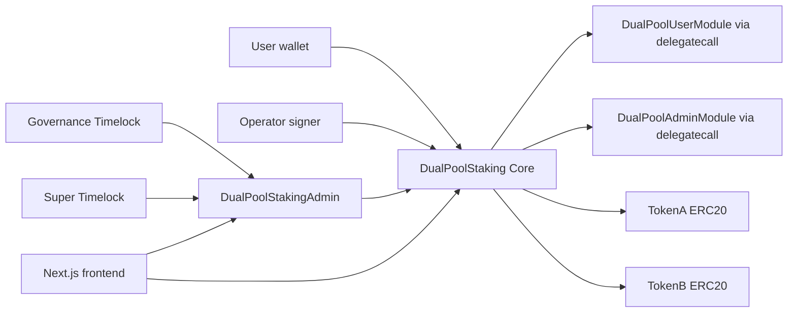

# Architecture

This document records the system boundaries and dependency direction for DualPoolStaking. It is intentionally about judgement and constraints; generated Solidity API pages remain under `docs/src/src`.

## System Context

DualPoolStaking is a fresh-deploy Solidity protocol with a Next.js frontend. The contracts custody TokenA principal for Pool A and TokenB principal/reward budget for Pool B. There is no oracle dependency in the contracts.

## Components

| Component | Responsibility | Trust level |
| --- | --- | --- |
| `DualPoolStaking` | External ABI, role checks, pausable guard, module routing, invariant checks | Trusted core |
| `DualPoolUserModule` | User stake, withdraw, claim, compound, emergency exits | Trusted delegatecall target |
| `DualPoolAdminModule` | Reward notification, admin setters, rebalance, recovery, shutdown, bad debt repair | Trusted delegatecall target |
| `DualPoolStakingAdmin` | Timelock-only facade for delayed governance calls | Trusted governance facade |
| `TokenA` | Pool A principal asset | Allowlisted dependency |
| `TokenB` | Pool B principal and reward asset | Allowlisted dependency with 18 decimals |
| Frontend | Transaction construction and user risk disclosure | Untrusted convenience layer |

## Dependency Direction

- Users and operators call `DualPoolStaking`; they must not call modules directly.
- Governance calls `DualPoolStakingAdmin`, which calls `DualPoolStaking`.
- Core delegates to modules; modules must share `DualPoolStorageLayout` exactly.
- Libraries hold accounting logic and must not own state.
- Frontend reads contract state and prepares transactions; contracts must not rely on frontend checks.

## Runtime Paths

User paths:

- `stakeA/B`: update global accounting, settle the user, receive principal by balance delta, update stake, optionally re-anchor stale reward budget.
- `withdrawA/B`: update global accounting, settle the user, debit principal, transfer gross amount out; FOT outbound tax is borne by the recipient.
- `claimA/B`: update global accounting, settle the user, debit pending reward, transfer gross reward out.
- `compoundB`: update both pools, settle both rewards, move settled TokenB rewards into Pool B principal.
- `forceClaimAll`: available only in shutdown or bad debt conditions; may partially pay.

Governance and operator paths:

- `notifyRewardAmountA/B`: operator funds rewards from itself, catches up global accounting, schedules a bounded emission window.
- `rebalanceBudgets`: governance moves only movable unscheduled budget between pools.
- `resolveBadDebt`: governance repairs bad debt from an explicit payer.
- `forceShutdownFinalize`: governance finalizes shutdown and preserves unsettled pending when stake remains.

## Deployment Topology

Production deployment must create:

- `DualPoolStaking`
- `DualPoolUserModule`
- `DualPoolAdminModule`
- `DualPoolStakingAdmin`
- Governance `TimelockController` with at least 48h delay
- Super `TimelockController` with at least 72h delay

The deployer must not retain production admin roles after deployment. `make deploy-production NETWORK=sepolia` enforces the production signer path and calls `script/check-production-readiness.sh`.

## Non-Negotiable Constraints

- TokenB must have 18 decimals.
- TokenA and TokenB must not be the same address.
- TokenA and TokenB must not be rebasing, ERC777 hook-based, blacklist-dependent, or callback-based production assets.
- Module addresses must contain code and their reviewed bytecode hashes must be recorded before launch.
- `TokenB balance + badDebt` must cover TokenB liabilities within `DUST_TOLERANCE`.
- All production role changes must pass through the appropriate timelock except operator emergency paths.

